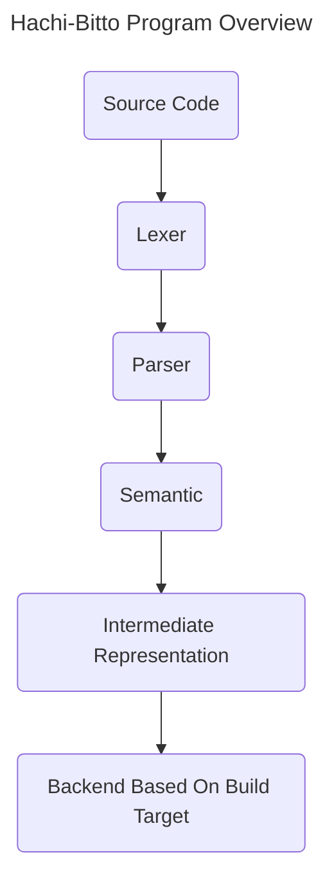

# Hachi-Bitto (8-bit)

A programming language with the purpose of satisfying YAPL (yet another programming language).

This language will leverage the power of LLVM to finish the process of building an executable for a processor as a future feature but not in the MVP.

Why name it "Hachi-Bitto"?
1. I have an odd obsession with naming my projects with Japanese pronunciation of things. **Hachi** stands for the number 8 and **Bitto** stands for bit.
2. I am building a custom 8-bit computer and I plan to use this programming language to write programs for that computer.
# Compilation Process


# Hachi-Bitto Features

- Hachi-Bitto is going to be a very simple general purpose programming language.
## Data Types

The language will only support integer representation of data for the MVP. For future releases, floating numbers will be supported.

The primitive data types supported:

- integer
- char
- boolean
- float (upcoming in feature releases)

Specific size of each type will depend on the target that the code is being built for. By default, it is good to assume that they are going to be 4 bytes (32 bits).
### Structures

A structure is a combination of all the primitive data types, just like how it is done in C for example.

### Arrays

The language will have support to arrays (static/dynamic size using the heap). An array can only contain the same data type.
## Variables

All variables are tied to a type. All variables start with the default value of `0`. This means that for number types (**int** and **double**) the initial value will be `0` and for **char** and **string** will have the initial value of `\0` .

Variables will be scoped by blocks. Variables declared on the global scope will be accessible by all parts of the code.

```
let int a = 1;
let char b = 'a';
let bool c = false;

let int[size] x = [1, 2, 3 ...];
```
## Functions

All functions in Hachi-Bitto needs to have a return type and an identifier that does not collide with any variable within scope.

Functions can be declared inside of another function but they cannot be passed as an argument or stored in a variable like in JavaScript.

Functions can have up to 255 arguments. Each argument must have an identifier that does not collide with any other variable within the scope and a type.

```
fn foo(int a) int {
	return a;
};

foo(2);
```

## Loops
Hachi-Bitto supports two types of loops: `while` and `for` loops. They behave like any other loop.
```
while (true) {
	...something
}

for (let int i=0;i<n;i++) {
	...something
}
```

## Conditional Branching
The language will support conditional branching.
```
if (true) {
	...do
} else if (true) {
	...do
} else {
	...do
}
```

# Hachi-Bitto Syntax

## Comments
In Hachi-Bitto, there are one line comments only by prefixing a line with `//`. Anything that comes after `//` will be ignore during compilation.

## Expressions

An expression is something that evaluates to a value

```
1; // this is an expression
1 + 1; // this is also an expression
'a' + 'a'; // this is also an expression that will yield and string "aa"
"hello" + 'w'; // this is also an epxression because it will evaluate a new value
```

## Boolean Expressions

A boolean expression is just like a regular expression but it evaluates a boolean by using relational operators.

- `>`
- `<`
- `==`
- `!=`
- `>=`
- `<=`
